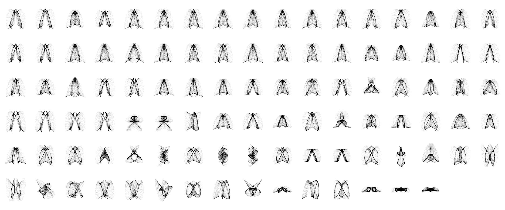

# Evolving harmonographs

This tutorial covers the implementation and application of a Genetic Algorithm on a generative design process.

The goal of the tutorial is to evolve computer-generated drawings. In particular, we will be evolving [harmonographs](https://en.wikipedia.org/wiki/Harmonograph). To be precise, we will evolve a set of parameters that control the algorithmic drawing of harmonographs.

*Screenshot of a population of harmonographs being evolved to resemble the letter A*

### Modules

The tutorial is structured in a series of modules:

1. Hello harmonograph
2. Random harmonographs
3. Class harmonograph
4. Population of harmonographs
5. Recombine harmonographs
6. Mutate harmonographs
7. Evaluate harmonographs
8. Tournament of harmonographs
10. Automatic evolution of harmonographs
11. Interactive evolution of harmonographs

Each module consists of a Processing *sketch* that implements and demonstrates a particular evolutionary concept or mechanism. The modules are linked and sequenced to pave the way for the development of an evolutionary system at the end.

### Prerequisites

- Intermediate Processing (*e.g.* the ability to work with arrays and create classes).

### Credits

This activity was created by [Tiago Martins](http://cdv.dei.uc.pt/people/tiago-martins/) and [Sérgio Rebelo](https://cdv.dei.uc.pt/authors/sergio-rebelo/) for the Computational Creativity for Design course unit of the master's degree in [Design and Multimedia](https://dm.dei.uc.pt) (Faculty of Sciences and Technology of the University of Coimbra).