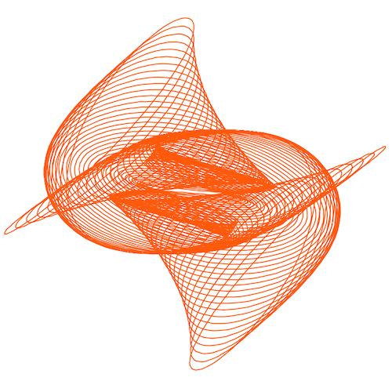

### Hello harmonograph!

This program draws a harmonograph which is defined by several parameters. Try adjusting the parameters and see the resulting harmonograph.

### Challenges

- Animate the drawing of the line and add a parameter to adjust the drawing velocity.
- Draw the line with some transparency to show the line overlapping itself and add a parameter to dynamically adjust the transparency value.