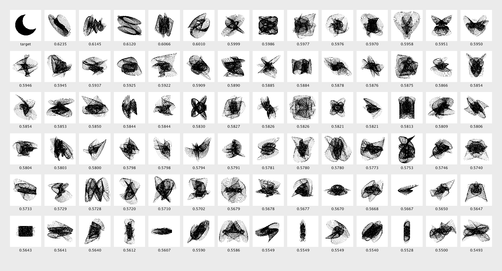

# Evaluation

This module demonstrates the evaluation of individuals. The `Evaluator` class is introduced to enable the calculation of the fitness of each individual.

The fitness function is based on the similarity to a target image on a pixel-by-pixel basis. To achieve this, we calculate the [Root-Mean-Square Error (RMSE)](https://en.wikipedia.org/wiki/Root-mean-square_deviation) between.

### Challenge

- Implement and test your own fitness function(s). For example, try creating a fitness function that measures the area of each harmonograph (number of dark pixels).