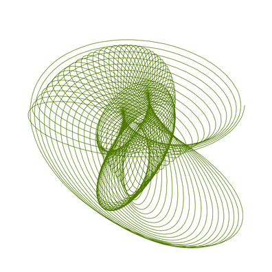

### Random Harmonograph

This program creates different harmonographs and enables interaction with the drawing process, namely the adjustment of the line length and the density of the points that define the line.

### Challenges

- When drawing the harmonograph using points, make them change their size based on the angle of the line at that point.
- Implement interaction to enable the control of one or more parameters using the x- and/or y-position of the mouse.