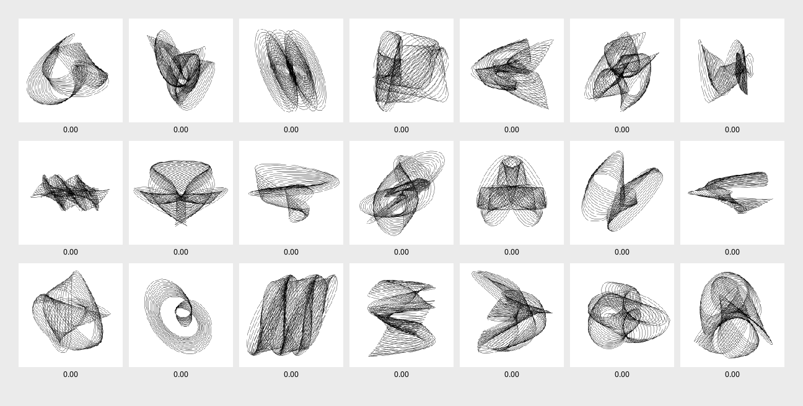

# Interactive Evolution of Harmonographs

This module demonstrates the use of an **Interactive Genetic Algorithm** to evolve harmonograph drawings, where users manually assign fitness to the drawings being evolved. This module is built upon the automatic approach demonstrated in the previous module, thus also implementing elitism and tournament-based selection.

*Population of harmonographs being manually evaluated and evolved*

### Controls

Users can interact with the program using the following controls:

- While the mouse is hovered over an individual:
	- Mouse click to toggle its fitness between `0` and `1`;
	- Press key `↑` to increase its fitness (preset increment);
	- Press key `↓` to decrease its fitness (preset decrement);
	- Press key `→` to set its fitness to `1` (maximum);
	- Press key `←` to set its fitness to `0` (minimum);
	- Press key `e` to export it to file.
- Press `spacebar` to create a new generation (*i.e.* evolve population);
- Press key `i` to (re)initialise population with random individuals.

### Challenges

- Change the code to generate each new generation using only the individuals evaluated by the user. See, for example, the original Interactive Genetic Algorithm presented by Karl Sims in [Interactive Evolution of Dynamical Systems](https://www.karlsims.com/papers/DynamicalSystemsECAL92.pdf) (1992).
- Implement a hybrid approach that combines automatic and interactive evaluation.